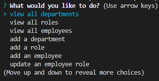

# <Employee Tracker>

## Description

This application was created to show how to use MYSQL to create a command line application to keep track of employees. This version is slightly tweaked to list the employees working under Korea's JYPE entertainment company as active singers. A few members from each group are listed under their group names which are categorized into the type of group they are, whether they are in a boy group, girl group, or a band.

## Installation

The user needs to install inquirer and mysql to get the application running on the command line.

## Usage

User will be prompted to choose what they want to do. They can view each table and its data and also add data to each table.

Example video here: https://drive.google.com/file/d/1WDnVW6cxFyQc4lDBX9M57Xd12T6NEGjX/view

## Credits

https://www.npmjs.com/package/inquirer
https://www.npmjs.com/package/mysql2
https://www.npmjs.com/package/console.table

